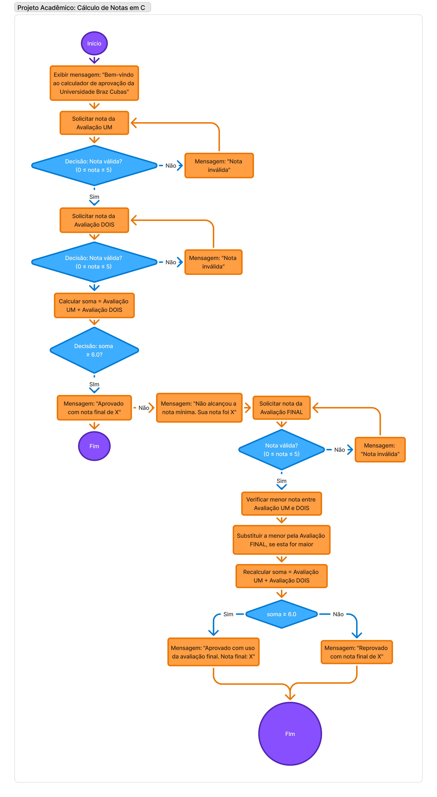

---

### Calculadora de Aprovação

```markdown
# 🎓 Calculadora de Aprovação – Universidade Braz Cubas

Este é um programa simples em linguagem C que simula o cálculo de aprovação de um aluno com base em três avaliações.
O sistema segue as regras de avaliação da Universidade Braz Cubas
e permite a substituição da menor nota caso a média inicial não seja suficiente para a aprovação.

---

## 🧮 Lógica de Cálculo

O algoritmo segue as seguintes etapas:

1. Solicita as notas da **Avaliação 1** e da **Avaliação 2** (valores entre 0 e 5).
2. Calcula a soma das duas notas:
   - Se a soma for **maior ou igual a 6.0**, o aluno está **aprovado**.
   - Se a soma for **menor que 6.0**, o programa solicita a **Avaliação Final**.
3. A **menor nota entre as duas iniciais** pode ser substituída pela **nota da Avaliação Final**, se for maior.
4. A nova soma é reavaliada:
   - Se for **maior ou igual a 6.0**, o aluno está **aprovado com uso da Avaliação Final**.
   - Caso contrário, o aluno está **reprovado**.

---

### 🧭 Diagrama do Fluxo do Programa

Este diagrama representa a lógica de funcionamento do programa de cálculo de notas acadêmicas desenvolvido em linguagem C.

- 📌 **Link do Figma (visualização)**:  
  [Abrir no Figma](https://www.figma.com/board/84CKqSOhuSD4Yc3flHUkvJ/Untitled?node-id=0-1&t=xkf1ostwAGcp0h9N-1)

- 🖼️ **Visualização do Diagrama (JPG):**

  

---

## 💻 Como compilar

### 🟢 Dev-C++

1. Abra o **Dev-C++**.
2. Vá em **Arquivo > Novo > Projeto** e selecione **Console Application**.
3. Escolha a linguagem **C**.
4. Copie e cole o código do arquivo `aprovacao.c`.
5. Pressione `F9` para **compilar e executar**.

> 💡 Certifique-se de salvar o arquivo com a extensão `.c`, por exemplo: `aprovacao.c`.

---

```

### 🪟 GCC (MinGW no Windows)

```bash
gcc -o aprovacao.exe aprovacao.c
aprovacao.exe
```

---

## 🧪 Exemplo de uso

```txt
Ola, bem-vindo ao calculador oficial de aprovacao da Universidade Braz Cubas
Por favor, insira sua nota na Avaliacao UM:
> 3.5
Por favor, insira sua nota na Avaliacao DOIS:
> 2.0
Voce nao alcancou a nota minima. Sua nota foi 5.50
Por favor, insira a nota da Avaliacao Final:
> 4.0
Aprovado com uso da avaliacao final. Nota final: 7.50
```

---

## 📂 Estrutura do código

- `aprovacao.c` – Código-fonte principal.

Principais variáveis:
- `avaliacaoUm`, `avaliacaoDois`, `avaliacaoFinal`: notas inseridas pelo usuário.
- `soma`: soma das duas melhores notas.
- `menorNota`: usada para decidir qual nota será substituída pela final.

---

## 🤝 Contribuindo

Pull Requests são bem-vindos! Se você tem ideias para melhorar o projeto, corrigir bugs ou adicionar funcionalidades, sinta-se à vontade para colaborar.

---

## 📘 Licença

Este projeto é de uso educacional e pode ser modificado ou reutilizado livremente para fins acadêmicos.

---
| [Samuel Conceição de Souza – @SamDevFocus](https://github.com/SamDevFocus) | [Viniciius Araujo Alves – @seu-usuario](https://github.com/seu-usuario) |
|:--:|:--:|
|  |  |


